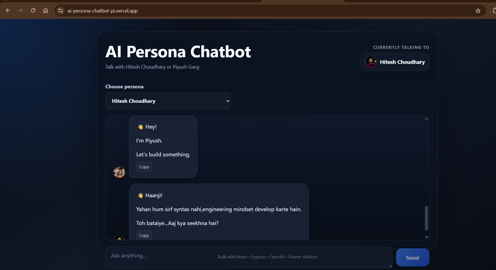
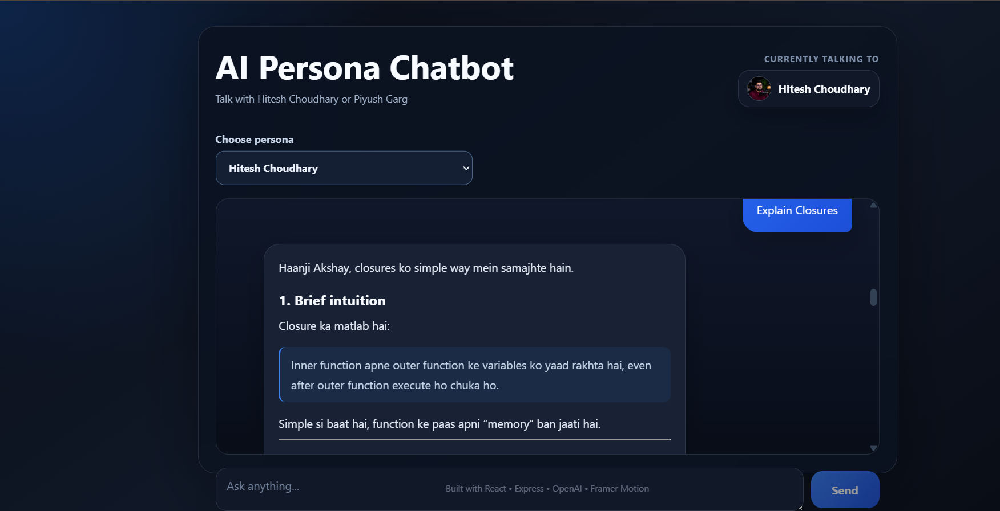
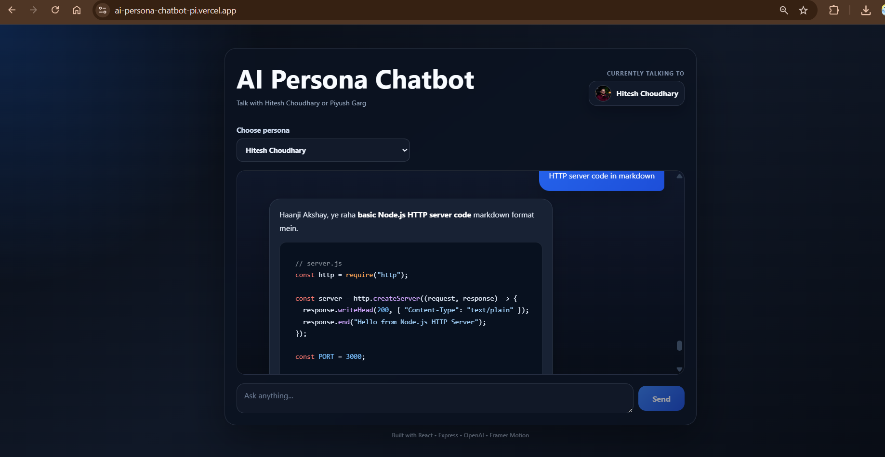
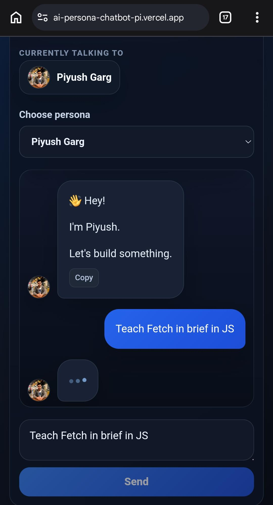

<h1 align="center">🤖 AI Persona Chatbot</h1>

<p align="center">
An AI-powered chatbot that recreates the teaching styles of <b>Hitesh Choudhary</b> and <b>Piyush Garg</b> using OpenAI GPT.
</p>

<p align="center">
React • Vite • Express.js • OpenAI GPT • Prompt Engineering • Markdown • Framer Motion
</p>
## 📚 Table of Contents

- [🚀 Live Demo](#-live-demo)
- [📖 Overview](#-overview)
- [✨ Features](#-features)
- [🧠 Prompt Engineering](#-prompt-engineering)
- [🛠 Tech Stack](#-tech-stack)
- [🏗 Project Architecture](#-project-architecture)
- [📁 Folder Structure](#-folder-structure)
- [⚡ Installation](#-installation)
- [🔑 Environment Variables](#-environment-variables)
- [📡 API](#-api)
- [📸 Screenshots](#-screenshots)
- [🚧 Challenges](#-challenges-faced)
- [🚀 Future Improvements](#-future-improvements)
- [🙏 Acknowledgements](#-acknowledgements)


##  Live Demo

### 🌐 Frontend

https://ai-persona-chatbot-pi.vercel.app/

## 📂 Source Code

GitHub Repository

https://github.com/learnerakshay/ai-persona-chatbot


---
# 📖 Overview

AI Persona Chatbot is a full-stack web application that recreates the conversational styles of Hitesh Choudhary and Piyush Garg using OpenAI GPT.

Instead of simply changing names, each persona is driven by carefully engineered system prompts that control tone, vocabulary, teaching style, humor, and response formatting.

The project demonstrates modern full-stack development, prompt engineering, API integration, markdown rendering, and production deployment.

---  

# ✨ Features

- 🤖 AI-powered persona chatbot
- 🎭 Multiple AI personalities (Hitesh Choudhary & Piyush Garg)
- 🧠 Persona-specific prompt engineering
- 💬 Persistent conversation memory
- 📝 Markdown rendering
- 💻 Syntax-highlighted code blocks
- 📋 One-click copy responses
- ⚡ Typing animation while generating responses
- 📱 Fully responsive UI
- 🎨 Smooth Framer Motion animations
- ☁️ Production deployment using Vercel + Render
- 💬 Conversation Memory
- 📝 Markdown Rendering

---

# 📸 Screenshots

## 🏠 Home Screen

<p align="center">
  
</p>

---

## 💬 Chat Conversation

<p align="center">
  
</p>

---

## 📝 Markdown Rendering

<p align="center">
  
</p>

---

## 📱 Mobile Responsive View

<p align="center">
  
</p>

---
# 🧠 Prompt Engineering

Unlike a traditional chatbot that only changes names, this project uses dedicated **system prompts** for each persona.

Each prompt controls:

- Communication style
- Teaching methodology
- Vocabulary
- Signature phrases
- Technical depth
- Humor and sarcasm
- Behavioural constraints
- Response formatting

This allows both personas to answer the same question while maintaining distinct personalities and teaching approaches. 

| Layer | Technology |
|--------|------------|
| Frontend | React, Vite, CSS3, Framer Motion |
| Backend | Node.js, Express.js |
| AI | OpenAI GPT |
| Markdown | react-markdown, remark-gfm, rehype-highlight |
| Deployment | Vercel, Render |
| Version Control | Git, GitHub |
 
# 🏗 Project Architecture

```text
                User
                  │
                  ▼
        React + Vite Frontend
                  │
            Fetch API (POST)
                  │
                  ▼
        Express.js Backend API
                  │
      Persona Prompt Builder
                  │
                  ▼
           OpenAI GPT API
                  │
                  ▼
        AI Generated Response
                  │
                  ▼
Markdown Rendering + Syntax Highlighting
```
# 📁 Folder Structure

```text
AI-PERSONA-CHATBOT
│
├── frontend
│   ├── src
│   ├── assets
│   ├── components
│   ├── App.jsx
│   └── App.css
│
├── backend
│   ├── server.js
│   ├── package.json
│   └── .env
│
├── readme-assets
│
└── README.md
``` 
---

 
# ⚡ Installation

Clone the repository

```bash
git clone https://github.com/learnerakshay/ai-persona-chatbot.git
```

Move into the project

```bash
cd ai-persona-chatbot
```

Install frontend dependencies

```bash
cd frontend
npm install
```

Install backend dependencies

```bash
cd ../backend
npm install
```

---  
# 🔑 Environment Variables

Create a `.env` file inside the backend directory.

```env
OPENAI_API_KEY=your_openai_api_key
``` 

# 📡 API

### POST /chat

Request

```json
{
  "persona": "hitesh",
  "messages": [
    {
      "role": "user",
      "content": "Explain React Hooks"
    }
  ]
}
```

Response

```json
{
  "reply": "..."
}
``` 
 
## Challenges Faced

- Persona consistency
- Markdown rendering
- Deployment
- Conversation persistence
- CORS
- Responsive layout

## Future Improvements

- Streaming responses
- Voice interaction
- Authentication
- Custom personas
- Database-backed history

# 🙏 Acknowledgements

Special thanks to:

- Hitesh Choudhary
- Piyush Garg

for inspiring the educational personas used in this project.

This project is built for educational and learning purposes only.

# 👨‍💻 Author

**Akshay**

GitHub:
https://github.com/learnerakshay

# 📄 License

This project is licensed under the MIT License.

---

⭐ If you liked this project, consider giving it a star on GitHub!